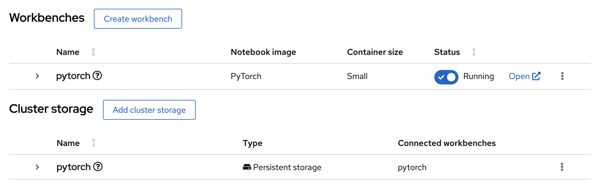

:experimental:

== Sound Classification Demo with Red Hat OpenShift Data Science

This demo uses Red Hat OpenShift Data Science (RHODS) to train and deploy a model that classifies sounds.
Sounds are classified into categories such as `dog`.

* Hybrid model deployment approach:
  * RHODS model serving: inference is performed in a cluster. Applications such as web front ends can send requests to this model.
  * Embedded model serving: the model can be deployed to devices such as RPI, to perform inference at the edge.

== Prerequisites

To complete this demo, you need the following:

* A Red{nbsp}Hat account (to create the developer sandbox).
* Access to an S3 storage bucket (to store the trained model).
+
[NOTE]
====
You can use the free tiers offered by services such as _Amazon S3_ or _IBM Cloud Object Storage_ (to store the trained model).
====

== Instructions

1. Start the Developer Sandbox.

a. Start the sandbox.

b. Log in to the sandbox with your Red{nbsp}Hat credentials.

2. Open Red{nbsp}Hat OpenShift Data Science (RHODS).

a. Click the applications menu in the top navigation bar,
then click btn:[Red{nbsp}Hat OpenShift Data Science].
+
image::./assets/ocp-top-bar.png[]

b. If prompted, log in with your Red{nbsp}Hat OpenShift credentials.

3. Configure the Jupyter workbench of your data science project.

a. Click btn:[Data Science Projects] in the left sidebar.
+
image::./assets/rhods-side-menu.png[]

b. The project list displays one project called `_youruser_-dev`.
This is the project that the developer sandbox precreates for you.
Click this project.

c. In the project page, click btn:[Create workbench] and complete the form with the following values.
+
[cols="1,1"]
|===
|*Name*
|pytorch

|*Notebook image* - Image selection
|PyTorch

|*Notebook image* - Version selection
|Select the option with PyTorch v1.13.1
|===
+
Leave the default values for the rest of the fields.

d. Click btn:[Create workbench].
RHODS creates the workbench and the associated persistent storage.
+

4. Configure a data connection.
+
The data connection provides the workbench with access to a storage layer to save the trained model.
Additionally, a data connection also provides RHODS Model Serving with the files required to serve a model.

a. Click btn:[Add data connection].

b. In the `name` field, enter `model-storage-data-connection`.

c. Complete the `AWS_*` fields  with the connection details of an S3-compatible API.
+

+
[NOTE]
====
This demo uses IBM Cloud Object Storage, but you can use any storage service that provides an S3 API.
====

d. In the `Connected workbench` field, select `pytorch`
to assign this data connection to the `pytorch` workbench.

e. Click btn:[Add data connection].
This data connection injects the S3 configuration values as environement variables in the `pytorch` workbench.
RHODS restarts the worbench to inject the variables.

5. Create a model server.
+
A RHODS model server can serve the models that you store in the storage layer of a data connection.

a. Click btn:[Configure server].

b. Activate the `Make deployed models available through an external route` option.
Leave the rest of the values unchanged.

c. Click btn:[Configure].
+
[IMPORTANT]
====
Due to the restricted permissions of the sandbox, you might see a `403` error message.

You can safely ignore the message. Close the modal window and refresh the page.
The UI should display a model server called `ovms` with zero deployed models.
====

6. Open the workbench and clone the demo code.

a. In the `pytorch` workbench, click btn:[Open].

b. If prompted, log in with your Red{nbsp}Hat credentials.

c. Click btn:[Allow selected permissions] to grant the workbench access to your data science project.

7. Clone the code repository.

a. Click the btn:[Git] icon in the left sidebar.

b. Click btn:[Clone a repository].
Enter https://github.com/jramcast/rhods-sound-classification as the repository, and click btn:[Clone].

c. In the file explorer, navigate to the `rhods-sound-classfication` directory.

8. Follow the instructions in the Jupyter notebooks and run them to download, analyze the dataset, and train the model.

a. Download the dataset.
+
Double-click the `0-download.ipynb` notebook.
In the top navigation bar, click menu:Run[Run All Cells].

b. Analyze the data.
+
Double-click the `1-analysis.ipynb` notebook.
In the top navigation bar, click menu:Run[Run All Cells].

c. Train the model.
+
Double-click the `2-training.ipynb` notebook.
In the top navigation bar, click menu:Run[Run All Cells].
+
Note that the last cell of this notebook uploads the trained model to your S3 storage bucket.

9. Deploy the model with the RHODS model server.

a. Return to the RHODS data science project browser tab.

b. In the `ovms` model server, click btn:[Deploy Model].

c. Complete the form with the following values.
+
[cols="1,1"]
|===
|*Model Name*
|`sound-classifier-model`

|*Model framework*
|`onnx - 1`

|*Existing data connection* - Name
|`model-storage-data-connection`

|*Existing data connection* - Folder path
|`sound_classifier.onnx`
|===

d. Click btn:[Deploy].
Wait until the model status is ready.
+
[IMPORTANT]
====
The model server might not detect when the model becomes available.

If the UI still displays the `Waiting for runtime Pod to become available` status after several minutes, then copy the inference endpoint and navigate to this endpoint in a new browser tab.

If you get a JSON response with the `Method Not Allowed` message, then the model is ready for inference.
====

10. Run the test notebook.

a. Copy the inference endpoint of the deployed model.

b. In the `pytorch` workbench, click btn:[⋮], then click btn:[Edit workbench].

c. Scroll down to the `Environment variables` and add a new variable.
Select `Config Map` as the variable type, then select `Key / value`, and set the key and value of the variable:
  * Key: `INFERENCE_ENDPOINT`.
  * Value: The inference endpoint of the deployed model.

d. Click btn:[Update workbench] and wait for the workbench to restart.

e. Return to the browser tab where Jupyter is running and refresh the tab.

f. Double-click the `3-test.ipynb` notebook.
In the top navigation bar, click menu:Run[Run All Cells].

g. Verify that the notebook displays the estimated class both by using the local model and the deployed model.

11. Deploy the applications that use the model.
+
[NOTE]
====
Under development...
====

