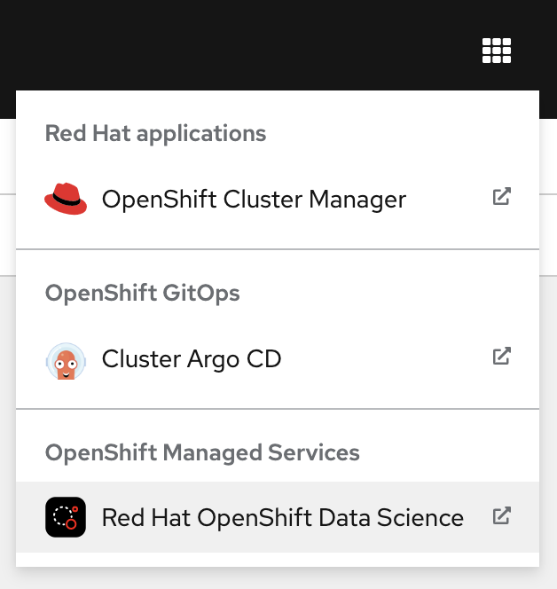
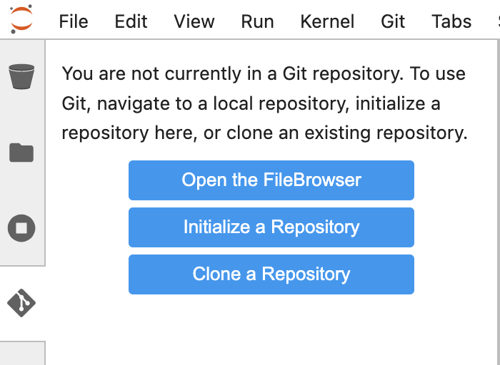

:experimental:

== Sound Classification Demo with Red Hat OpenShift Data Science

This demo uses Red{nbsp}Hat OpenShift Data Science (RHODS) to train and deploy a model that classifies sounds.
Sounds are classified into categories such as `dog`.

* Hybrid model deployment approach:
  * RHODS model serving: inference is performed in a cluster. Applications such as web front ends can send requests to this model.
  * Embedded model serving: the model can be deployed to devices such as RPI, to perform inference at the edge.

== Prerequisites

To complete this demo, you need the following:

* RHODS installed and running in a cluster.
+
[NOTE]
====
You can get an instance of RHODS in the https://developers.redhat.com/developer-sandbox[Developer Sandbox].
====

* Access to an S3 storage bucket (to store the trained model).
+
[NOTE]
====
You can use the free tiers offered by services such as _Amazon S3_ or _IBM Cloud Object Storage_ (to store the trained model).
====

== Instructions

1. *Open Red{nbsp}Hat OpenShift Data Science (RHODS).*

a. In a web browser, navigate to the Web Console of your Red{nbsp}Hat OpenShift cluster, and log in.

b. Click the applications menu in the top navigation bar of OpenShift,
then click btn:[Red{nbsp}Hat OpenShift Data Science].
+

c. If prompted, log in with your Red{nbsp}Hat OpenShift credentials.

2. *Configure the workbench of your data science project.*
+
A RHODS workbench is a containerized application that includes commonly used data science tools and libraries, such as JupyterLab, Tensorflow, and PyTorch.
RHODS provides you with a collection of workbench container images, each one preconfigured and tailored to a specific data science use case.

a. Click btn:[Data Science Projects] in the left sidebar.
+
image::./assets/rhods-side-menu.png[width=35%,align="center"]

b. Create a data science project.
Click btn:[Create data science project].
In the modal window that opens, enter a name and click btn:[Create].

c. Click the newly created project.

d. In the project page, click btn:[Create workbench] and complete the form with the following values.
+
[cols="1,1"]
|===
|*Name*
|`pytorch`

|*Notebook image* - Image selection
|`PyTorch`

|*Notebook image* - Version selection
|Select the option with PyTorch v1.13.1
|===
+
Do not modify the default values of the rest of the fields.
+
[NOTE]
====
If you choose a different name for the workbench, you will need to adjust
the following steps accordingly.
====

e. Click btn:[Create workbench].
RHODS creates the workbench and the associated persistent storage.
+
image::./assets/created-workbench.png[width=90%,align="center"]

3. *Configure a data connection.*
+
A data connection provides the workbench with access to a storage layer.
In this demo, you use the storage layer to save the trained model.
+
Additionally, a data connection also configures RHODS Model Serving with the required settings to download the model to be served.

a. Click btn:[Add data connection].

b. In the `name` field, enter `model-storage-data-connection`.

c. Complete the `AWS_*` fields  with the connection details of an S3-compatible API.
+

+
[NOTE]
====
This example uses IBM Cloud Object Storage, but you can use any storage service that provides an S3 API.
====

d. In the `Connected workbench` field, select `pytorch`
to assign this data connection to the `pytorch` workbench.

e. Click btn:[Add data connection].
This data connection injects the S3 configuration values as environement variables in the `pytorch` workbench.
RHODS restarts the worbench to inject the variables.

4. *Create a model server.*
+
A RHODS model server can serve the models that you save in the storage layer of a data connection.

a. Scroll down to the `Models and model servers` section and click btn:[Configure server].

b. Activate the `Make deployed models available through an external route` option.
Leave the rest of the values unchanged.

c. Click btn:[Configure].
+
The model server is now configured and ready to serve models.

5. *Open the workbench and clone the demo code.*
+
You will use this code to train and deploy the model.

a. Make sure that the `pytorch` workbench is running and click btn:[Open].
+

b. If prompted, log in with your Red{nbsp}Hat OpenShift credentials.

c. Click btn:[Allow selected permissions] to grant the workbench access to your data science project.

d. Verify that the JuyperLab interface opens in a new browser tab.

e. Click the btn:[Git] icon in the left sidebar.

f. Click btn:[Clone a repository].
+

g. Enter https://github.com/jramcast/rhods-sound-classification as the repository, and click btn:[Clone].

h. In the file explorer, navigate to the `rhods-sound-classfication` directory.

6. *Download the dataset, analyze the data, and train the model.*
+
Follow the instructions in the Jupyter notebooks and run them to download, analyze the dataset, and train the model.

a. Download the dataset.
+
Double-click the `0-download.ipynb` notebook.
In the top navigation bar, click menu:Run[Run All Cells].

b. Analyze the data.
+
Double-click the `1-analysis.ipynb` notebook.
In the top navigation bar, click menu:Run[Run All Cells].

c. Train the model.
+
Double-click the `2-training.ipynb` notebook.
In the top navigation bar, click menu:Run[Run All Cells].
+
Note that the last cell of this notebook uploads the trained model, which is stored in the `sound_classifier.onnx` file, to the root directory of your S3 storage bucket.

7. *Deploy the model with the RHODS model server.*

a. Return to the RHODS data science project browser tab.

b. In the `ovms` model server, click btn:[Deploy Model].
+

c. Complete the form with the following values.
+
[cols="1,1"]
|===
|*Model Name*
|`sound_classifier`

|*Model framework*
|`onnx - 1`

|*Existing data connection* - Name
|`model-storage-data-connection`

|*Existing data connection* - Folder path
|`sound_classifier.onnx`
|===
+
The data connection configuration values allow RHODS to download the `sound_classifier.onnx` model file from S3 and use it to serve the model with the OpenVINO model sever.

d. Click btn:[Deploy].
Wait until the model status is ready.
+
image::./assets/model-server-ready.png[width=90%,align="center"]

8. *Run the test notebook.*

a. Copy the inference endpoint of the deployed model.

b. In the `pytorch` workbench, click btn:[⋮], and then click btn:[Edit workbench].
+

c. Scroll down to the `Environment variables` and add a new variable.
Select `Config Map` as the variable type, then select `Key / value`, and set the key and value of the variable:
  * Key: `INFERENCE_ENDPOINT`.
  * Value: The inference endpoint of the deployed model.
  +
+

d. Click btn:[Update workbench] and wait for the workbench to restart.

e. Return to the browser tab where Jupyter is running and refresh the tab.

f. Double-click the `3-test.ipynb` notebook.
In the top navigation bar, click menu:Run[Run All Cells].
+
Note that the notebook tests the same model by using two approaches:
+
  * The first test uses the `sound_classifier.onnx` model file that resulted from training the model.
  * The second test verifies the model deployed with RHODS model serving, by sending an HTTP request to the inference endpoint.

g. Verify that the notebook displays the estimated class both by using the local model and the deployed model.

9. *Deploy the model embedded in a CLI*
+
Build a container image for a CLI that includes the model.
This container image embeds the model, so you can use this application to perform inference at the edge.
+
[NOTE]
====
Under development...
====

a. Log in with `oc`.

b. Create the pipeline.
+
[subs="+quotes"]
----
$ oc apply -f
----

c. Run the pipeline to build the image.

d. Log in podman into the sandbox image registry.
+
[subs="+quotes"]
----
$ podman login -u __YOUR_USER__ -p $(oc whoami -t) \
  default-route-openshift-image-registry.apps.__YOUR_SANDBOX__.openshiftapps.com
----

c. Run the container to classify a sound.
+
[subs="+quotes"]
----
$ podman run \
  default-route-openshift-image-registry.apps.__YOUR_SANDBOX__.openshiftapps.com/__YOUR_USER__/sound-classification-cli \
  https://github.com/jramcast/rhods-sound-classification/raw/main/samples/waves.wav
----
+
This container includes the model, so you can use it to perform inference at the edge.

10. *Deploy an application that uses the deployed model via the Model Service REST API*.
+
[NOTE]
====
Under development...
====

