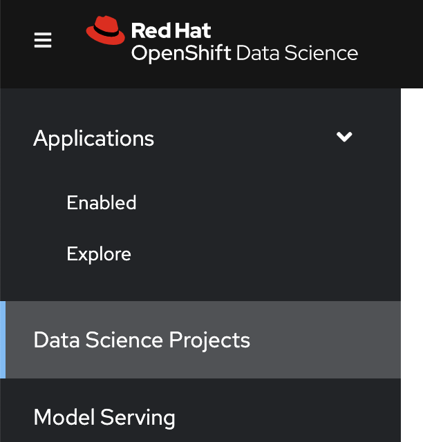

:experimental:

:github_user:  jramcast

== Sound Classification Demo with Red{nbsp}Hat OpenShift Data Science

This demo uses Red{nbsp}Hat OpenShift Data Science (RHODS) to train and deploy a machine learning model that classifies sounds.
Sounds are classified into categories such as `dog`.

You will deploy the model in two ways:

RHODS Model Serving::
Inference is performed in the cluster.
Applications such as web front ends can send inference requests to this model via HTTP.

Embedded in a Container Image::
Inference is performed at the edge.
The model is embedded in a container image, as a CLI application.
The container image can be therefore deployed to any environment with a container runtime.

The following diagram illustrates the general flow of this exercise:

== Prerequisites

To complete this demo, you need the following:

* RHODS and Red{nbsp}Hat OpenShift Pipelines installed and running in a cluster.
+
[NOTE]
====
You can get an instance of RHODS in the https://developers.redhat.com/developer-sandbox[Developer Sandbox].
====
+
[NOTE]
====
This demo has been tested on the following versions:

[compact]
* Red{nbsp}Hat OpenShift Container Platform: 4.10
* Red{nbsp}Hat OpenShift Data Science: 1.26
* Red{nbsp}Hat OpenShift Pipelines: 1.10.2
====

* Access to an S3 storage bucket (to store the trained model).
+
[NOTE]
====
You can use the free tiers offered by services such as _Amazon S3_ or _IBM Cloud Object Storage_ (to store the trained model).
====

* Podman (or Docker) and the `oc` CLI installed on your computer.
+
[NOTE]
====
You can download `oc` from https://mirror.openshift.com/pub/openshift-v4/clients/oc/latest/. Select your operating system, download the compressed file, and extract its contents into a directory that is on your `PATH`.
====

== Instructions

1. *Open the RHODS dashboard.*

a. In a web browser, navigate to the Web Console of your Red{nbsp}Hat OpenShift cluster, and log in.

b. Click the applications menu in the top navigation bar of OpenShift,
then click btn:[Red{nbsp}Hat OpenShift Data Science].
+
image::./assets/ocp-top-bar.png[width=35%,align="center"]

c. If prompted, log in with your Red{nbsp}Hat OpenShift credentials.

2. *Configure the workbench of your data science project.*
+
A RHODS workbench is a containerized application that includes commonly used data science tools and libraries, such as JupyterLab, Tensorflow, and PyTorch.
RHODS provides you with a collection of workbench container images, each one preconfigured and tailored to a specific data science use case.

a. Click btn:[Data Science Projects] in the left sidebar.
+

b. Create a data science project.
Click btn:[Create data science project].
In the modal window that opens, enter a name and click btn:[Create].
+
[NOTE]
====
If you are using Red{nbsp}Hat OpenShift from the developer sandbox, then a project is already created for you.
====

c. Click the newly created project.

d. In the project page, click btn:[Create workbench] and complete the form with the following values.
+
[cols="1,1"]
|===
|*Name*
|`pytorch`

|*Notebook image* - Image selection
|`PyTorch`

|*Notebook image* - Version selection
|Select the option with PyTorch v1.13.1
|===
+
Do not modify the default values of the rest of the fields.
+
[NOTE]
====
If you choose a different name for the workbench, you will need to adjust
the following steps accordingly.
====

e. Click btn:[Create workbench].
RHODS creates the workbench and the associated persistent storage.
+
image::./assets/created-workbench.png[width=90%,align="center"]

3. *Configure a data connection.*
+
A data connection provides the workbench with access to a storage layer.
In this demo, you use the storage layer to save the trained model.
+
Additionally, a data connection also configures RHODS Model Serving with the required settings to download the model to be served.

a. Click btn:[Add data connection].

b. In the `name` field, enter `model-storage-data-connection`.

c. Complete the `AWS_*` fields  with the connection details of an S3-compatible API.
+
image::./assets/data-connection-form.png[width=70%,align="center"]
+
[NOTE]
====
This example uses IBM Cloud Object Storage, but you can use any storage service that provides an S3 API.
====

d. In the `Connected workbench` field, select `pytorch`
to assign this data connection to the `pytorch` workbench.

e. Click btn:[Add data connection].
This data connection injects the S3 configuration values as environement variables in the `pytorch` workbench.
RHODS restarts the worbench to inject the variables.

4. *Create a model server.*
+
A RHODS model server can serve the models that you save in the storage layer of a data connection.

a. Scroll down to the `Models and model servers` section and click btn:[Configure server].

b. Activate the `Make deployed models available through an external route` option.
Leave the rest of the values unchanged.

c. Click btn:[Configure].
+
The model server is now configured and ready to serve models.

5. *Open the workbench and clone the demo code.*
+
You will use the demo code to train and deploy the model.

a. Make sure that the `pytorch` workbench is running and click btn:[Open].
+
image::./assets/workbench-open-link.png[width=40%,align="center"]

b. If prompted, log in with your Red{nbsp}Hat OpenShift credentials.

c. Click btn:[Allow selected permissions] to grant the workbench access to your data science project.

d. Verify that the JuyperLab interface opens in a new browser tab.

e. Click the btn:[Git] icon in the left sidebar.

f. Click btn:[Clone a repository].
+
image::./assets/git-clone-menu.png[width=40%,align="center"]

g. Enter https://github.com/{github_user}/rhods-sound-classification as the repository, and click btn:[Clone].

h. In the file explorer, navigate to the `rhods-sound-classfication` directory.

6. *Download the dataset, analyze the data, and train the model.*
+
Follow the instructions in the Jupyter notebooks and run them to download, analyze the dataset, and train the model.

a. Download the dataset.
+
Double-click the `0-download.ipynb` notebook.
In the top navigation bar, click menu:Run[Run All Cells].
+
Inspect the notebook.

b. Analyze the data.
+
Double-click the `1-analysis.ipynb` notebook.
In the top navigation bar, click menu:Run[Run All Cells].
+
Inspect the notebook.

c. Train the model.
+
Double-click the `2-training.ipynb` notebook.
In the top navigation bar, click menu:Run[Run All Cells].
+
Note that the last cell of this notebook uploads the trained model, which is stored in the `sound_classifier.onnx` file, to the root directory of your S3 storage bucket.

7. *Deploy the model with the RHODS model server.*

a. Return to the RHODS data science project browser tab.

b. In the `ovms` model server, click btn:[Deploy Model].
+
image::./assets/deploy-model-btn.png[width=80%,align="center"]

c. Complete the form with the following values.
+
[cols="1,1"]
|===
|*Model Name*
|`sound_classifier`

|*Model framework*
|`onnx - 1`

|*Existing data connection* - Name
|`model-storage-data-connection`

|*Existing data connection* - Folder path
|`sound_classifier.onnx`
|===
+
The data connection configuration values allow RHODS to download the `sound_classifier.onnx` model file from S3 and use it to serve the model with the OpenVINO model sever.

d. Click btn:[Deploy].
Wait until the model status is ready.
+

8. *Run the test notebook.*

a. Copy the inference endpoint of the deployed model.

b. In the `pytorch` workbench, click btn:[⋮], and then click btn:[Edit workbench].
+
image::./assets/edit-workbench-btn.png[width=30%,align="center"]

c. Scroll down to the `Environment variables` section and add a new variable.
Select `Config Map` as the variable type, then select `Key / value`, and set the key and value of the variable:
  * Key: `INFERENCE_ENDPOINT`.
  * Value: The inference endpoint of the deployed model.
+
image::./assets/workbench-env-vars.png[width=70%,align="center"]

d. Click btn:[Update workbench] and wait for the workbench to restart.

e. Return to the browser tab where Jupyter is running and refresh the tab.

f. Double-click the `3-test.ipynb` notebook.
In the top navigation bar, click menu:Run[Run All Cells].
+
Note that the notebook tests the same model by using two approaches:
+
  * The first test uses the `sound_classifier.onnx` local file that contains the trained model.
  * The second test verifies the model deployed with RHODS Model Serving, by sending an HTTP request to the inference endpoint.

g. Verify that the notebook displays the estimated class both by using the local model and the deployed model.

9. *Create a pipeline to deploy the model embedded in a CLI*
+
Build a container image for a CLI that includes the model.
This container image embeds the model, so you can use this application to perform inference at the edge.

a. In the Red{nbsp}Hat OpenShift web console, select the btn:[Developer] perspective, and click btn:[Secrets], then click menu:Create[Key/value secret].
+
The pipeline requires this secret to download the model from S3 and include it in the container image.

b. Enter `s3-model-storage` as the btn:[Secret name].
+
[NOTE]
====
If you use a different name, then you will have to adjust this name in the pipeline run.
====

c. Add the following key/values to the secret:
+
[compact]
* `AWS_ACCESS_KEY_ID`
* `AWS_DEFAULT_REGION`
* `AWS_S3_BUCKET`
* `AWS_S3_ENDPOINT`
* `AWS_SECRET_ACCESS_KEY`
+
Use the same values that you have used to define the data connection in your RHODS project.
+
[NOTE]
====
After adding one key/value, click btn:[Add key/value] to add more.
====
Click btn:[Create].

d. From the developer perspective of the Red{nbsp}Hat OpenShift web console, click btn:[+Add].

e. In the btn:[From Local Machine] card, click btn:[Import YAML].

f. Paste the contents of the https://github.com/{github_user}/rhods-sound-classification/blob/main/apps/embedded/pipelines/pipeline.yaml file and click btn:[Create].
+
This YAML creates the pipeline that builds the container image for the CLI application.

g. Find the pipeline that you just created.
+
In the navigation pane, click btn:[Pipelines].
Verify that the page lists one pipeline.

h. Run the pipeline.
Click btn:[⋮], then click btn:[Start].
+
In the form that opens, select `VolumeClaimTemplate` as the btn:[shared-workspace].
If you previously created the S3 secrets with a name different from `s3-model-storage`, adjust the btn:[s3-secret] accordingly.
+
Click btn:[Start].
+
Wait for the pipeline to finish.
If the pipeline succeeds, then the container image of the CLI application should be available in the Red{nbsp}Hat OpenShift internal registry.

10. *Run the CLI*

a. Log in to Red{nbsp}Hat OpenShift with the `oc` CLI.
+
In the Red{nbsp}Hat OpenShift web console, click btn:[your-username] in the upper-right corner, then click btn:[Copy login command].
+
Log in if prompted, and click btn:[Display Token].
Copy the `oc login` command under btn:[Log in with this token].
+
Open a new terminal window, and execute the command that you just copied:
+
[subs=+quotes,source,shell]
----
$ *oc login  \
--token=_YOUR-TOKEN_
--server=https://_OPENSHIFT-API_*
Logged into ... using the token provided.

_...output omitted..._

Using project ...
----

b. Log in with podman into the OpenShift image registry.
Replace `__YOUR_USER__` and `__YOUR_SANDBOX__` to match the domain of your OpenShift cluster.
+
[subs="+quotes"]
----
$ *podman login -u __YOUR_USER__ -p $(oc whoami -t) \
  default-route-openshift-image-registry.apps.__YOUR_SANDBOX__.openshiftapps.com*

Login Succeeded!
----

c. Run the CLI container to classify a sound.
+
[subs="+quotes,+attributes"]
----
$ *podman run \
  default-route-openshift-image-registry.apps.__YOUR_SANDBOX__.openshiftapps.com/__YOUR_USER__/sound-classification-cli \
  https://github.com/{github_user}/rhods-sound-classification/raw/main/samples/waves.wav*

Downloading file...
Classifying...

 * Class: clock_tick (6)
----
+
This container includes the model, so you can use it to perform inference at the edge.

11. *Deploy a web application that uses the deployed model via the Model Service REST API*.

a. From the developer perspective of the OpenShift web console, and click btn:[+Add], then click btn:[Import YAML].

b. In the form, paste the contents of the https://github.com/jramcast/rhods-sound-classification/blob/main/apps/web/back/k8s.yaml file.
Replace the value of the `INFERENCE_ENDPOINT` environment variable with the inference URL of the model that you have deployed with RHODS Model Serving.
+
Click btn:[Create].

c. In the topology view, click the Python icon that represents the backend application that you just deployed.
+
In the pane that opens, copy the URL of the route from the btn:[Routes] section.
You must pass this URL as an environment variable to the front end.

d. Click btn:[+Add], then click btn:[Import YAML].

e. In the form, paste the contents of the https://github.com/jramcast/rhods-sound-classification/blob/main/apps/web/front/k8s.yaml file.
Replace the value of the `BACKEND` environment variable with the route URL of the backend.
+
Click btn:[Create].

f. From the topology view, open the URL of the front-end application.

g. In the front-end application, enter the https://github.com/jramcast/rhods-sound-classification/raw/main/samples/waves.wav URL and wait for the application to classify the sound.
+
[NOTE]
====
The btn:[Live Recording] section can categorize audio recorded from the microphone.
To use this feature, however, you must expose the front end service by using an HTTPS/TLS route, which is out of the scope of this demo.
====
